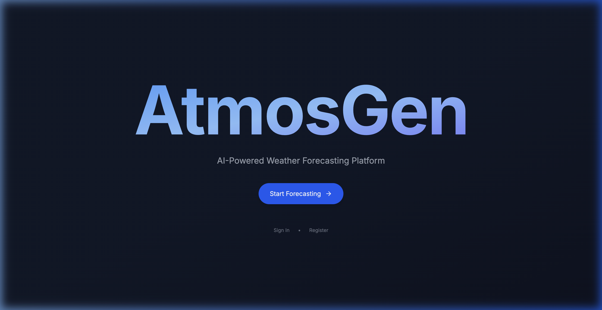
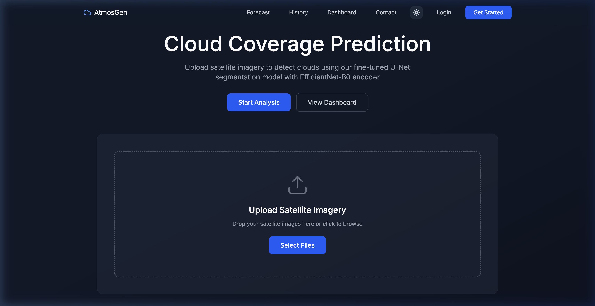
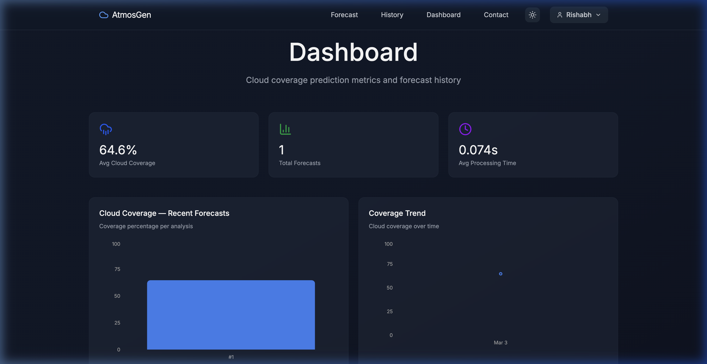

<div align="center">

#  AtmosGen

### AI-Powered Cloud Coverage Prediction from Satellite Imagery

Upload satellite images  get pixel-level cloud segmentation masks and coverage percentages in under a second, powered by a fine-tuned **U-Net + EfficientNet-B0** deep learning model trained on **GOES-18 Band 13** infrared data.

[](https://python.org)
[](https://fastapi.tiangolo.com)
[](https://react.dev)
[](https://typescriptlang.org)
[](https://mongodb.com)
[](LICENSE)

<br />



<br />

[Getting Started](#-getting-started) · [Features](#-features) · [Architecture](#-architecture) · [API Reference](#-api-reference) · [Contributing](#-contributing)

</div>

---

##  What It Does

AtmosGen takes satellite imagery as input and produces:

1. **Cloud Segmentation Mask** — a binary mask identifying cloud vs. clear-sky pixels
2. **Cloud Coverage Percentage** — the fraction of the image covered by clouds
3. **Overlay Visualization** — the original image with detected clouds highlighted

All predictions are stored per-user, enabling historical tracking and trend analysis through an analytics dashboard.

---

##  Features

- **Deep Learning Inference** — U-Net architecture with EfficientNet-B0 encoder; sub-second predictions on GPU
- **Drag-and-Drop Upload** — Upload satellite images via the browser; supports PNG, JPG, and TIFF formats
- **Analytics Dashboard** — Track average cloud coverage, total forecasts, processing times, and view coverage trends with interactive charts
- **Forecast History** — Searchable, sortable log of every prediction with detailed results
- **JWT Authentication** — Secure user accounts with cookie-based session management
- **Dark / Light Theme** — System-aware with manual toggle; dark mode default
- **Responsive Design** — Glassmorphism UI with Framer Motion animations, fully mobile-friendly
- **FAQ & Contact** — Built-in FAQ page and contact form that opens a pre-filled email

---

##  Screenshots

<div align="center">

<table>
<tr>
<td align="center"><strong>Cloud Coverage Prediction</strong></td>
<td align="center"><strong>Analytics Dashboard</strong></td>
</tr>
<tr>
<td></td>
<td></td>
</tr>
</table>

</div>

---

##  Architecture

```
AtmosGen/
├── backend/                  # FastAPI server
│   ├── main.py               # Routes, middleware, lifecycle
│   ├── cloud_model.py        # U-Net model loading & inference
│   ├── auth_service.py       # JWT token creation & validation
│   ├── mongodb_client.py     # MongoDB CRUD operations
│   ├── database.py           # Database abstraction layer
│   ├── schemas.py            # Pydantic request/response models
│   ├── satellite_service.py  # GOES-18 satellite data integration
│   └── requirements.txt
├── frontend/                 # React 19 + TypeScript
│   ├── src/
│   │   ├── app/
│   │   │   ├── pages/        # Landing, Forecast, Dashboard, History,
│   │   │   │                  # Login, Register, Contact, FAQ, 404
│   │   │   ├── components/   # Navigation, ThemeProvider
│   │   │   └── layouts/      # AppLayout wrapper
│   │   └── lib/              # API client, auth context
│   └── package.json
├── checkpoints/              # Trained model weights (.pth)
├── core_model/               # Training scripts & model definitions
└── data/                     # Training & evaluation datasets
```

### Data Flow

```
Satellite Image ── FastAPI ── U-Net Model ── Cloud Mask + Coverage %
                        │                              │
                        └── MongoDB ──────────────────┘
                              │
                    Dashboard ── Charts & History
```

---

##  Model Details

| | |
|---|---|
| **Architecture** | U-Net with EfficientNet-B0 encoder ([segmentation_models_pytorch](https://github.com/qubvel-org/segmentation_models.pytorch)) |
| **Pre-training** | ImageNet weights on encoder |
| **Fine-tuning Data** | GOES-18 Band 13 (10.3 µm longwave IR) satellite imagery |
| **Task** | Binary cloud segmentation |
| **Input** | Single-channel or RGB satellite image (auto-resized to 256×256) |
| **Output** | Binary mask + cloud coverage percentage + overlay visualization |
| **Framework** | PyTorch 2.x |
| **Inference** | ~70ms on GPU, ~200ms on CPU |

The model performs pixel-level classification, distinguishing cloud from clear-sky regions. A probability threshold of 0.5 is applied to the sigmoid output to generate the binary mask. Cloud coverage is calculated as the ratio of cloud pixels to total pixels.

---

##  Getting Started

### Prerequisites

| Requirement | Version |
|---|---|
| Python | 3.10+ |
| Node.js | 18+ |
| MongoDB | Local instance or [MongoDB Atlas](https://www.mongodb.com/atlas) |
| GPU *(optional)* | CUDA-compatible for faster inference |

### 1. Clone the repository

```bash
git clone https://github.com/Rishabh1925/AtmosGen.git
cd AtmosGen
```

### 2. Set up the backend

```bash
python -m venv .venv
source .venv/bin/activate   # Windows: .venv\Scripts\activate
pip install -r requirements.txt
```

Create `backend/.env`:

```env
MONGODB_URI=mongodb+srv://<user>:<pass>@<cluster>.mongodb.net/atmosgen
JWT_SECRET=your-secret-key
```

Start the server:

```bash
cd backend
python main.py
# API available at http://localhost:8000
```

### 3. Set up the frontend

```bash
cd frontend
npm install
npm run dev
# App available at http://localhost:5173
```

---

##  API Reference

All endpoints are served from the FastAPI backend at `http://localhost:8000`.

### Authentication

| Method | Endpoint | Description |
|---|---|---|
| `POST` | `/auth/register` | Create a new user account |
| `POST` | `/auth/login` | Authenticate and receive JWT |
| `POST` | `/auth/logout` | Clear session cookie |
| `GET` | `/auth/me` | Get current authenticated user |

### Prediction

| Method | Endpoint | Description |
|---|---|---|
| `POST` | `/predict` | Upload satellite image(s)  returns cloud mask, coverage %, and overlay |

### Dashboard & History

| Method | Endpoint | Description |
|---|---|---|
| `GET` | `/dashboard` | Aggregated stats: avg coverage, total forecasts, avg processing time |
| `GET` | `/forecasts` | List all forecasts for the authenticated user |
| `GET` | `/forecasts/{id}` | Get a specific forecast by ID |

### Satellite Info

| Method | Endpoint | Description |
|---|---|---|
| `GET` | `/satellite/regions` | List available GOES-18 satellite regions |
| `GET` | `/satellite/layers` | List available satellite data layers |

---

##  Tech Stack

### Backend
- **FastAPI** — async Python web framework
- **PyTorch** + **segmentation_models_pytorch** — model architecture and inference
- **MongoDB** — document store for users, forecasts, and analytics
- **JWT** — stateless authentication with HTTP-only cookies

### Frontend
- **React 19** + **TypeScript** — component-based UI
- **Tailwind CSS** — utility-first styling
- **Recharts** — bar charts and gradient area charts
- **Framer Motion** — page transitions and micro-animations
- **React Router** — client-side routing

### ML Pipeline
- **GOES-18 Band 13** — 10.3 µm longwave infrared satellite data
- **U-Net + EfficientNet-B0** — encoder-decoder segmentation architecture
- **PIL / NumPy** — image preprocessing and postprocessing

---

##  Contributing

Contributions are welcome! Here's how:

1. **Fork** the repository
2. **Create** a feature branch: `git checkout -b feature/your-feature`
3. **Commit** your changes: `git commit -m "Add your feature"`
4. **Push** to the branch: `git push origin feature/your-feature`
5. **Open** a Pull Request

For bug reports or feature requests, [open an issue](https://github.com/Rishabh1925/AtmosGen/issues).

---

##  License

This project is licensed under the **MIT License** — see the [LICENSE](LICENSE) file for details.

---

<div align="left">

Built by [Rishabh](https://github.com/Rishabh1925)

---
</div>
